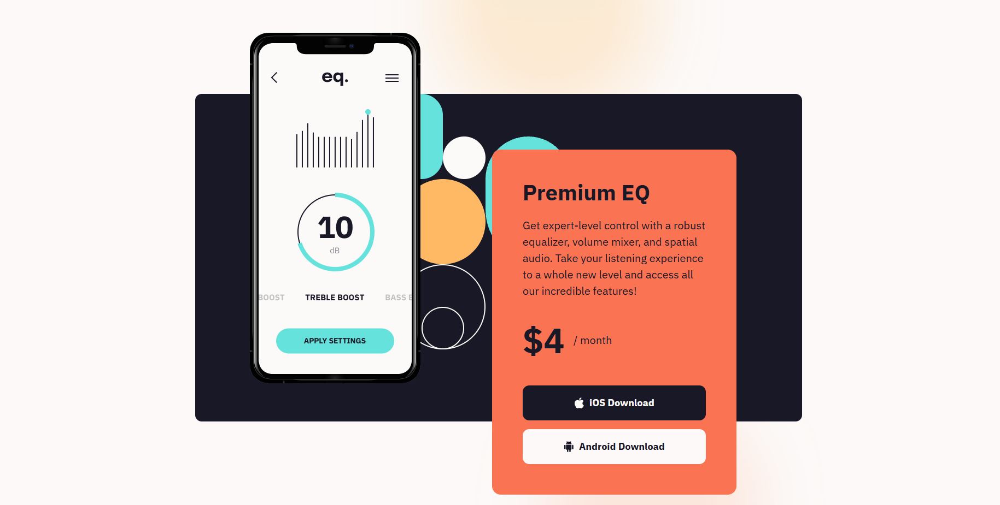
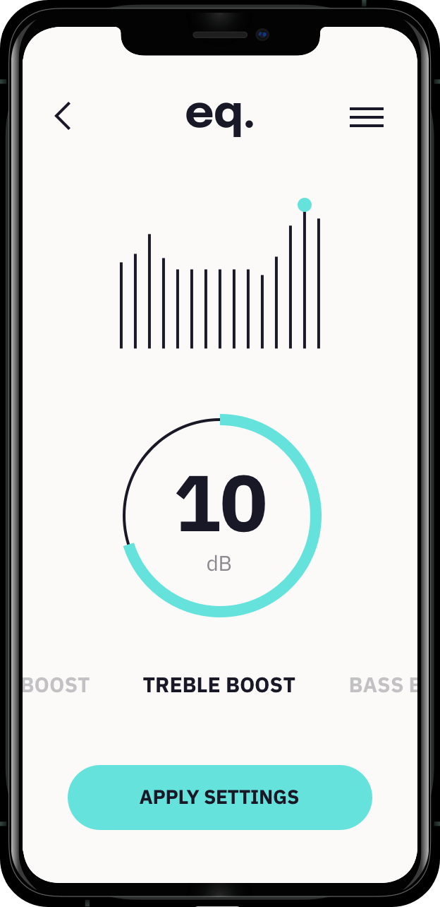

# Frontend Mentor - Equalizer landing page solution

This is a solution to the [Equalizer landing page challenge on Frontend Mentor](https://www.frontendmentor.io/challenges/equalizer-landing-page-7VJ4gp3DE). Frontend Mentor challenges help you improve your coding skills by building realistic projects.

## Table of contents

- [Overview](#overview)
  - [The challenge](#the-challenge)
  - [Screenshot](#screenshot)
  - [Links](#links)
- [My process](#my-process)
  - [Built with](#built-with)
  - [What I learned & Key Challenges](#what-i-learned--key-challenges)
- [Project Estimation & Retrospective](#project-estimation--retrospective)
- [Author](#author)

## Overview

### The challenge

Users should be able to:

- View the optimal layout depending on their device's screen size.
- See a responsive Equalizer landing page that adapts between mobile, tablet, and desktop layouts.
- Experience a visually accurate implementation of the provided Frontend Mentor design.
- View the Equalizer app presentation and pricing information in a clear and structured layout.
- Interact with the iOS and Android download buttons.
- See hover and keyboard focus states for interactive elements.
- View decorative background patterns that adapt to different screen sizes.
- Experience a layout that closely matches the provided Frontend Mentor reference.

### Screenshot

  
*Fig 1. Final responsive implementation of the Equalizer landing page challenge using semantic HTML5, BEM methodology, SCSS, CSS custom properties, Flexbox, responsive media queries, and accessible interactive states.*

### Links

- Solution URL: [Solution Link](https://github.com/Osty-trainee/equalizer-landing-page)
- Live Site URL: [Live Site Link](https://osty-trainee.github.io/equalizer-landing-page/)

## My process

### Built with

- Semantic HTML5 markup using `header`, `main`, `section`, `footer`, headings, paragraphs, buttons, and links.
- BEM (Block-Element-Modifier) methodology for organizing CSS classes.
- SCSS with nested selectors and modular imports.
- CSS custom properties (`:root`) for reusable colors, typography, and spacing values.
- Flexbox for organizing the pricing card, footer content, buttons, and social links.
- Responsive design using CSS media queries for mobile, tablet, and desktop layouts.
- Responsive background images and decorative patterns for different screen sizes.
- CSS transitions for smooth hover interactions.
- `:focus-visible` states for improved keyboard accessibility.
- Border radius, spacing, typography, and positioning to closely reproduce the original design.
- Semantic and accessible attributes such as descriptive `aria-label` values for interactive controls.

### What I learned & Key Challenges

This project was a good exercise in building a responsive landing page from a provided design while keeping the HTML structure semantic and the SCSS architecture organized and maintainable.

#### 1. Responsive Backgrounds
One of the main challenges was reproducing the decorative background patterns and adapting them to different viewport sizes. For tablet layouts, the page uses a combination of decorative SVG and raster background images:

```scss
body {
  background-image: 
    url('../assets/image/bg-pattern-1.svg'),
    url('../assets/image/bg-main-tablet.png');
  background-repeat: no-repeat, no-repeat;
  background-position: 
    551px -40px,
    left -400px top -200px;
  background-size: 267px 400px, 1200px auto;
}
```

For larger desktop screens, the background changes to a desktop-specific image and uses different positioning and sizing:

```scss
@media (min-width: 1100px) {
  body {
    background-image: 
      url('../assets/image/bg-pattern-1.svg'),
      url('../assets/image/bg-main-desktop.png');
    background-repeat: no-repeat, no-repeat;
    background-position: 
      1200px -40px,
      left -400px top -200px;
    background-size: 312px 468px, 1950px auto;
  }
}
```

This allows the decorative background to adapt to different screen sizes while maintaining the visual appearance of the original design.

#### 2. Responsive App Preview Section
The app preview section required different dimensions and positioning depending on the viewport size. On mobile, the phone illustration is centered and overlaps the dark background section:

```scss
.app-preview {
  background-color: var(--state);
  padding: var(--spacing-600) var(--spacing-250);
  margin-top: 160px; 
  max-height: 23.75rem;

  &__img {
    width: 13.125rem;
    height: 100%;
    margin: -160px auto 0 auto;
  }
}
```

For desktop layouts, the section becomes wider and the illustration is positioned closer to the left side:

```scss
@media (min-width: 1100px) {
  .app-preview {
    max-width: 70rem;
    width: 100%;
    max-height: 37.5rem;
    border-radius: 12px;
    margin: 0 auto;
    margin-top: var(--spacing-2500);
    margin-bottom: var(--spacing-2500);

    &__img {
      width: 19.5rem;
      display: inline;
      margin: -160px auto var(--spacing-2500) var(--spacing-1000);
    }
  }
}
```

This creates the overlapping composition from the original Frontend Mentor design.

#### 3. Positioning the Pricing Card
Another challenge was positioning the orange pricing card so that it overlaps the app preview section on tablet and desktop layouts. On tablet screens, the pricing section is moved upwards using a negative margin:

```scss
.pricing {
  max-width: 22.25rem;
  margin-top: -720px;
  margin-left: 315px;
  position: relative;
  z-index: 10;
}
```

For larger screens, the card becomes wider and is positioned relative to the main content:

```scss
@media (min-width: 1100px) {
  .pricing {
    position: relative;
    z-index: 10;
    max-width: 32rem;
    max-height: 39.5rem;
    padding: var(--spacing-700);  
    border-radius: var(--spacing-200);
    
    margin-left: auto;
    margin-right: 120px;
    margin-top: -770px;
    transform: translateY(4.5rem);
  }
}
```

Using position, z-index, negative margins, and transform allowed the pricing card to overlap the app preview while keeping the layout responsive.

#### 4. BEM Methodology
I used BEM naming to keep the component structure organized and reduce styling conflicts. For example, the hero section uses the `hero` block:

```html
<section class="hero">
  <h1 class="hero__title">We make your music sound extraordinary</h1>
  <p class="hero__description">A system audio equalizer specifically designed for Android and iOS.</p>
</section>
```

The app preview section follows the same structure:

```html
<section class="app-preview">
  <div class="app-preview__container">
    
  </div>
</section>
```

The pricing section also uses BEM elements and modifiers for its buttons:

```html
<button class="btn btn--apple">
  
  iOS Download
</button>
<button class="btn btn--android">
  
  Android Download
</button>
```

This structure makes the SCSS easier to understand and maintain.

#### 5. CSS Custom Properties
I used CSS custom properties to centralize the main colors, typography, and spacing values:

```scss
:root {
  --cyan: hsl(177, 68%, 64%);
  --orange: hsl(12, 94%, 65%);
  --yellow: hsl(33, 100%, 70%);
  --white: hsl(20, 33%, 98%);
  --state: hsl(244, 23%, 12%);

  --spacing-2500: 12.5rem;
  --spacing-1600: 8rem;
  --spacing-1000: 5rem;
  --spacing-800: 4rem;
  --spacing-600: 3rem;
  --spacing-500: 2.5rem;
  --spacing-400: 2rem;
  --spacing-300: 1.5rem;
  --spacing-250: 1.25rem;
  --spacing-200: 1rem;
  --spacing-100: 0.5rem;

  --ff-main: 'IBM Plex Sans', sans-serif;
}
```

This made it easier to keep spacing and colors consistent throughout the project and simplified adjustments during responsive development.

#### 6. Hover and Focus States
The download buttons include both hover and keyboard focus states. For example, the iOS button changes its background and text color when hovered, and has a customized outline for keyboard navigation:

```scss
.btn--apple {
  background-color: var(--state);
  color: var(--white);

  &:hover {
    background-color: var(--cyan);
    color: var(--state);
  }

  &:focus-visible {
    outline: 3px solid var(--cyan);
    outline-offset: 3px;
  }
}
```

The Android button uses a similar interaction pattern tailored to its color scheme:

```scss
.btn--android {
  background-color: var(--white);
  color: var(--state);

  &:hover {
    background-color: var(--yellow);
    color: var(--state);
  }

  &:focus-visible {
    outline: 3px solid var(--yellow);
    outline-offset: 3px;
  }
}
```

Using `:focus-visible` provides a clear visual indicator for keyboard users and improves the accessibility of the interactive elements.

#### 7. Responsive Footer
The footer also changes its layout depending on the screen size. On mobile, the content is arranged vertically. On larger screens, Flexbox is used to place the logo, contact information, and social links in a horizontal layout:

```scss
@media (min-width: 1100px) {
  .footer {
    display: flex;
    flex-direction: row;
    align-items: center;
    justify-content: space-between;
    max-width: 70rem;
    width: 100%;
  }

  .footer__content {
    display: flex;
    flex-direction: row;
    align-items: center;
    justify-content: space-between;
    flex-grow: 1;
    margin-left: var(--spacing-1600);
  }
}
```

## Project Estimation & Retrospective

- **Initial Estimation:** 2 to 4 hours.
- **Actual Time Taken:** ~6 hours.

**Retrospective Summary:**  
This project helped me improve my understanding of responsive layouts and component-based CSS architecture. The main challenges were reproducing the background patterns, maintaining the correct card proportions across different screen sizes, and organizing the styles using BEM and SCSS. Overall, I became more confident with responsive design, SCSS structure, and reusable CSS variables. That said, the result isn't perfect, as there is still a lot I don't fully understand.

## Author

- GitHub - [@Osty-trainee](https://github.com/Osty-trainee)
- Frontend Mentor - [@Osty-trainee](https://www.frontendmentor.io/profile/Osty-trainee)